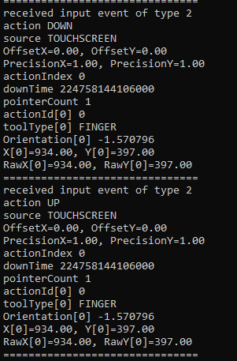

# InputMsgCapture

Capture input events of any android application by scanning malloc memory for InputConsumer instance then keep reading the InputMessage variable which receives inputs from InputPublisher paired socket.



<h2> Support: </h2>

- [x] Android 5.0  ~ 14
- [x] ABI arm, arm64, x86, x86_64
- [x] Compatible with imgui

<h2> Notes: </h2>

- The scan speed depends on malloc mapped memory if it's named or not, some devices uses "[anon:libc_malloc]" or "[anon:scudo_primary]" which will speed up the scan, however some devices use unnamed memory which then every unnamed memory will be scanned making it much slower
- Each activity will have an InputConsumer instance
- Make sure to use the correct activity, you can use multiple at once. For most games, the activity to use is the main one unless it's a splash activity then it should be ignored

<h2> How to use: </h2>

```cpp
#include "iMsgCapture/iMsgCapture.h"

// set a callback for new input events
iMsgCapture::instance().setCallback([](iMsgEvent* iMsg) -> void
{
    // show/hide menu with volume buttons
    if (iMsg->isKeyEvent())
    {
        if (iMsg->getKey()->getIsDown(AKEYCODE_VOLUME_DOWN))
            bShowMenu = false;
        else if (iMsg->getKey()->getIsDown(AKEYCODE_VOLUME_UP))
            bShowMenu = true;
    }

    // handle imgui input
    if (bImGuiInit && bShowMenu)
        ImGui_ImplAndroid_HandleInputMsg(iMsg);

    // logging

    iMSG_LOGI("received input event of type %d", iMsg->type());

    if (iMsg->isKeyEvent()) {
        const iKeyEvent *keyEvent = iMsg->getKey();
        iMSG_LOGI("keyCode %d", keyEvent->getKeyCode());
        iMSG_LOGI("scanCode %d", keyEvent->getScanCode());
        iMSG_LOGI("repeatCount %d", keyEvent->getRepeatCount());
        iMSG_LOGI("metaState %d", keyEvent->getMetaState());
        iMSG_LOGI("action %s", keyEvent->getActionString().c_str());
        iMSG_LOGI("source %s", keyEvent->getSourceString().c_str());
    } else if (iMsg->isMotionEvent()) {
        const iMotionEvent *motionEvent = iMsg->getMotion();
        iMSG_LOGI("action %s", motionEvent->getActionString().c_str());
        iMSG_LOGI("source %s", iMsg->getSourceString().c_str());
        iMSG_LOGI("OffsetX=%.2f, OffsetY=%.2f", motionEvent->getOffsetX(), motionEvent->getOffsetY());
        iMSG_LOGI("PrecisionX=%.2f, PrecisionY=%.2f", motionEvent->getPrecisionX(), motionEvent->getPrecisionY());
        iMSG_LOGI("actionIndex %d", motionEvent->getActionIndex());
        iMSG_LOGI("downTime %" PRId64, motionEvent->getDownTime());

        uint32_t pointerCount = motionEvent->getPointerCount();
        iMSG_LOGI("pointerCount %d", pointerCount);
        for (uint32_t i = 0; i < pointerCount; i++) {
            iMSG_LOGI("actionId[%d] %d", i, motionEvent->getActionId(i));
            iMSG_LOGI("toolType[%d] %s", i, motionEvent->getToolTypeString(i).c_str());
            iMSG_LOGI("Orientation[%d] %f", i, motionEvent->getOrientation(i));
            iMSG_LOGI("X[%d]=%.2f, Y[%d]=%.2f", i, motionEvent->getX(i), i, motionEvent->getY(i));
            iMSG_LOGI("RawX[%d]=%.2f, RawY[%d]=%.2f", i, motionEvent->getRawX(i), i, motionEvent->getRawY(i));
        }
    }

    iMSG_LOGI("===============================");
});

// set an update interval in microsecnds
iMsgCapture::instance().setUpdateInterval(1000);

// run thread
// each activity will have a consumer instance
// make sure to use the correct activity, you can use multiple at once
// For most games, the activity to use is the main one unless it's a splash activity then it should be ignored
iMsgCapture::instance().runThread(/* activity */ {"com.epicgames.ue4.GameActivity"}, /* retry on failure */ true, /* retry timer in seconds */ 1);
```

<h2> Scaling touch: </h2>
When surface width & height are scaled and do not match real device, then we need to setup ratio.

Example with OpenGLES surface:

```cpp
// This should be the real device width & height
int iDeviceWidth = 1920, iDeviceHeight = 1080;

int iDisplayWidth = 0, iDisplayHeight = 0;
eglQuerySurface(dpy, surface, EGL_WIDTH, &iDisplayWidth);
eglQuerySurface(dpy, surface, EGL_HEIGHT, &iDisplayHeight);

if (iDeviceWidth != iDisplayWidth) {
    iMsgCapture::instance().setTouchRatioX(float(iDisplayWidth) / float(iDeviceWidth));
}
if (iDeviceHeight != iDisplayHeight) {
    iMsgCapture::instance().setTouchRatioY(float(iDisplayHeight) / float(iDeviceHeight));
}
```

<h2>imgui: </h2>
in imgui_impl_android.h:

```cpp
int32_t ImGui_ImplAndroid_HandleInputMsg(class iMsgEvent* iMsg);
```

in imgui_impl_android.cpp:

```cpp
#include "iMsgCapture/iMsgEvent.h"
int32_t ImGui_ImplAndroid_HandleInputMsg(iMsgEvent* iMsg)
{
    ImGuiIO& io = ImGui::GetIO();
    if (iMsg->isKeyEvent())
    {
        const iKeyEvent *keyEvent = iMsg->getKey();
        int32_t event_key_code = keyEvent->getKeyCode();
        int32_t event_scan_code = keyEvent->getScanCode();
        int32_t event_action = keyEvent->getAction();
        int32_t event_meta_state = keyEvent->getMetaState();

        io.AddKeyEvent(ImGuiMod_Ctrl,  (event_meta_state & AMETA_CTRL_ON)  != 0);
        io.AddKeyEvent(ImGuiMod_Shift, (event_meta_state & AMETA_SHIFT_ON) != 0);
        io.AddKeyEvent(ImGuiMod_Alt,   (event_meta_state & AMETA_ALT_ON)   != 0);
        io.AddKeyEvent(ImGuiMod_Super, (event_meta_state & AMETA_META_ON)  != 0);

        switch (event_action)
        {
        case AKEY_EVENT_ACTION_DOWN:
        case AKEY_EVENT_ACTION_UP:
        {
            ImGuiKey key = ImGui_ImplAndroid_KeyCodeToImGuiKey(event_key_code);
            if (key != ImGuiKey_None && (event_action == AKEY_EVENT_ACTION_DOWN || event_action == AKEY_EVENT_ACTION_UP))
            {
                io.AddKeyEvent(key, event_action == AKEY_EVENT_ACTION_DOWN);
                io.SetKeyEventNativeData(key, event_key_code, event_scan_code);
            }

            break;
        }
        default:
            break;
        }
    }
    else if (iMsg->isMotionEvent())
    {
        const iMotionEvent *motionEvent = iMsg->getMotion();
        int32_t event_action = motionEvent->getActionMasked();
        int32_t event_pointer_index = motionEvent->getActionIndex();
        int32_t tool_type = motionEvent->getToolType(event_pointer_index);

        switch (tool_type)
        {
        case AMOTION_EVENT_TOOL_TYPE_MOUSE:
            io.AddMouseSourceEvent(ImGuiMouseSource_Mouse);
            break;
        case AMOTION_EVENT_TOOL_TYPE_STYLUS:
        case AMOTION_EVENT_TOOL_TYPE_ERASER:
            io.AddMouseSourceEvent(ImGuiMouseSource_Pen);
            break;
        case AMOTION_EVENT_TOOL_TYPE_FINGER:
        default:
            io.AddMouseSourceEvent(ImGuiMouseSource_TouchScreen);
            break;
        }

        switch (event_action)
        {
        case AMOTION_EVENT_ACTION_DOWN:
        case AMOTION_EVENT_ACTION_UP:
            if(tool_type == AMOTION_EVENT_TOOL_TYPE_FINGER || tool_type == AMOTION_EVENT_TOOL_TYPE_UNKNOWN)
            {
                io.AddMousePosEvent(motionEvent->getX(event_pointer_index), motionEvent->getY(event_pointer_index));
                io.AddMouseButtonEvent(0, event_action == AMOTION_EVENT_ACTION_DOWN);
            }
            break;
        case AMOTION_EVENT_ACTION_BUTTON_PRESS:
        case AMOTION_EVENT_ACTION_BUTTON_RELEASE:
            {
                int32_t button_state = motionEvent->getButtonState();
                io.AddMouseButtonEvent(0, (button_state & AMOTION_EVENT_BUTTON_PRIMARY) != 0);
                io.AddMouseButtonEvent(1, (button_state & AMOTION_EVENT_BUTTON_SECONDARY) != 0);
                io.AddMouseButtonEvent(2, (button_state & AMOTION_EVENT_BUTTON_TERTIARY) != 0);
            }
            break;
        case AMOTION_EVENT_ACTION_HOVER_MOVE:
        case AMOTION_EVENT_ACTION_MOVE:
            io.AddMousePosEvent(motionEvent->getX(event_pointer_index), motionEvent->getY(event_pointer_index));
            break;
        case AMOTION_EVENT_ACTION_SCROLL:
            io.AddMouseWheelEvent(motionEvent->getAxisValue(event_pointer_index, AMOTION_EVENT_AXIS_HSCROLL), motionEvent->getAxisValue(event_pointer_index, AMOTION_EVENT_AXIS_VSCROLL));
            break;
        default:
            break;
        }
        return 1;
    }

    return 0;
}
```
